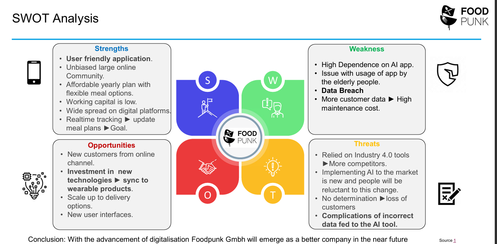

# Industry 4.0 – Survey & SME Case Study (FoodPunk GmbH)

## 📌 Overview
This project combines a **literature survey on Industry 4.0** with a **case study on FoodPunk GmbH**, a Munich-based start-up leveraging **AI and cloud-based platforms** for personalized nutrition. The study evaluates how **Industry 4.0 technologies** (AI, cloud, digital platforms) enable SMEs to transform business models, improve customer engagement, and scale rapidly in competitive markets.

---

## ⭐ STAR Summary

**Situation**  
SMEs in the food & health sector face challenges in scaling operations while providing personalized solutions, especially against established traditional competitors.

**Task**  
Analyze the **role of Industry 4.0 technologies** in SME transformation and evaluate FoodPunk GmbH’s digital business model as a practical case.

**Action**  
- Conducted **Industry 4.0 survey paper** highlighting key technologies (AI, Cloud, Digital Interfaces).  
- Performed **business model analysis** for FoodPunk using **Business Model Canvas, Porter’s Five Forces, and SWOT**.  
- Evaluated the **role of digitalization** (cloud data storage, AI-driven nutrition planning, customer apps).  
- Benchmarked FoodPunk against **traditional competitors and digital rivals**.

**Result**  
- Identified **AI-driven personalization** and **digital community building** as FoodPunk’s competitive edge.  
- Highlighted **opportunities for scaling** through wearable integrations and customized product delivery.  
- Provided insights into how **Industry 4.0 enables SMEs** to overcome traditional cost and scalability barriers.  
- Contributed to understanding of **SME adoption strategies** in digital health markets.

---

## 📊 Key Figures

### 1) Business Model Canvas
  
*Mapping FoodPunk’s activities, value proposition, resources, partners, and revenue streams.*

### 2) Porter’s Five Forces
  
*Industry analysis showing competitive pressures in digital health and nutrition sector.*

### 3) SWOT Analysis
  
*Strengths, Weaknesses, Opportunities, and Threats for FoodPunk GmbH in the Industry 4.0 landscape.*

---

## 📂 Reports

- 📑 **Industry 4.0 Survey Paper:** [`Industry4.0_Survey_Paper.pdf`](docs/reports/Industry4.0_Survey_Paper.pdf)  
- 🖥️ **FoodPunk Case Study Report:** [`FoodPunk_Case_Report.pdf`](docs/reports/FoodPunk_Case_Report.pdf)  
- 🎤 **Presentation Slides:** [`FoodPunk_Presentation.pdf`](docs/reports/FoodPunk_Presentation.pdf)

---

## 🧰 Methods & Tools
- **Industry 4.0 survey research** across manufacturing and service domains.  
- **Case study methodology** applied to FoodPunk GmbH.  
- **Frameworks:** Business Model Canvas, Porter’s Five Forces, SWOT.  
- **Digitalization focus:** AI, cloud storage (AWS, Cloudflare), digital customer platforms.

---

## 🔑 Key Takeaways
- Industry 4.0 is a **critical enabler for SMEs** to stay competitive.  
- **FoodPunk** demonstrates how AI + cloud + digital platforms create a **scalable, customer-centric model**.  
- Strategic frameworks help assess **digital maturity and competitive positioning**.  
- Insights applicable to **SMEs in manufacturing & health-tech sectors**.

---

## ⚖️ License
Distributed under the [MIT License](LICENSE).
